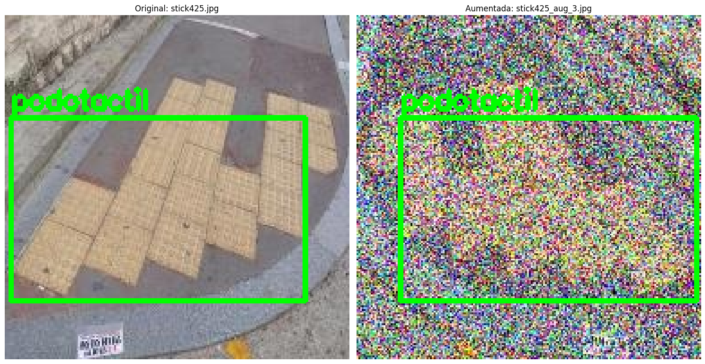

# 👁️ SenseLink-AI: Modelo de Detección de Riesgos Urbanos en el Borde


**SenseLink-AI** es un modelo de visión artificial de alto rendimiento y baja latencia, diseñado específicamente para **asistencia a personas con discapacidad visual**. 

Este proyecto se centra en la **optimización de redes neuronales** (basado en YOLO11n) para ejecutar detección de objetos críticos en hardware con recursos limitados (como la Raspberry Pi Zero 2 W), permitiendo su implementación en diversos dispositivos finales (wearables, bastones inteligentes o apps móviles) sin dependencia de internet.

---

## 📋 Tabla de Contenidos
1. [El Reto Técnico](#-el-reto-técnico)
2. [Arquitectura del Modelo](#-arquitectura-del-modelo)
3. [Ingeniería de Datos](#-ingeniería-de-datos)
4. [Benchmark de Rendimiento](#-benchmark-de-rendimiento)
5. [Instalación e Inferencia](#-instalación-e-inferencia)
6. [Estructura del Repositorio](#-estructura-del-repositorio)

---

## 🚩 El Reto Técnico
La detección de peligros urbanos (como baches o semáforos aéreos) es crítica para la seguridad de personas ciegas. Sin embargo, los modelos de detección actuales suelen ser:
1.  **Muy pesados:** Requieren GPUs potentes que no caben en un dispositivo portátil.
2.  **Dependientes de la Nube:** Introducen latencia y requieren conexión constante, lo cual es peligroso en cruces de calle.

**El objetivo de SenseLink-AI** es democratizar la seguridad visual creando un modelo capaz de correr *offline* en procesadores económicos de <$15 USD.

---

## 💡 Arquitectura del Modelo
Este proyecto implementa una pipeline de entrenamiento y optimización enfocada en **Edge Computing**:

* **Core:** YOLO11n (Nano), seleccionado por su balance entre precisión y velocidad.
* **Resolución Adaptativa:** Entrenado con variantes de tamaño de entrada (320px vs 640px) para seleccionar modelo que maximice FPS en CPUs ARM.
* **Versatilidad de Despliegue:** El modelo exportado es agnóstico al hardware final; sirve como "backend" de visión para cualquier aplicación de asistencia.
* **Robustez Ambiental:** Capaz de generalizar en condiciones de baja iluminación y clima adverso.

### Clases Críticas Detectadas
El modelo se especializa en 7 objetos de riesgo/interés vial:
1.  `semaforo_verde` ✅ (Cruce seguro)
2.  `semaforo_rojo` 🛑 (Peligro)
3.  `semaforo_amarillo` ⚠️ (Precaución)
4.  `escaleras` 🪜 (Riesgo de caída)
5.  `zebra` 🦓 (Zona de cruce)
6.  `podotactil` 🛤️ (Guía de suelo)
7.  `bache` 🕳️ (Irregularidad peligrosa)

---

## 🧠 Ingeniería de Datos

La mayor contribución técnica de este proyecto reside en la curación y aumento del dataset para situaciones del mundo real:

### 1. Balanceo de Clases Adaptativo
Se abordó el desbalance nativo de datasets urbanos (donde abundan semáforos pero escasean baches) mediante un script propio de **Data Augmentation Selectivo**:
* **Clases Mayoritarias:** Preservadas para evitar sobreajuste.
* **Clases Críticas (Baches/Amarillo):** Multiplicadas **8x - 12x** sintéticamente.

### 2. Simulación de Entorno (Albumentations)
Para garantizar que el modelo funcione cuando el usuario más lo necesita (mal clima), se entrenó con transformaciones avanzadas:
* 🌧️ **Lluvia y Niebla Sintética:** Robustez ante clima adverso.
* 💨 **Motion Blur:** Simulación del movimiento de la cámara al caminar.
* 🌑 **Ruido de Sensor:** Simulación de cámaras de baja calidad en entornos oscuros.

> **Estrategia de Aumentación:**
> 
> 
> *(Figura 1: Entrenamiento robusto mediante inyección de ruido y clima sintético)*

---

## ⚡ Benchmark de Rendimiento (Target: RPi Zero 2 W)

Se evaluaron dos variantes del modelo para determinar la viabilidad en el borde:

| Modelo | Input Size | Precisión (mAP@50) | Latencia (T4 GPU) |
| :--- | :--- | :--- | :--- |
| **SenseLink-AI Fast** | **320x320** | **0.797** | **~7.72ms** |
| SenseLink-AI High | 640x640 | [0.883] | ~7.95ms |

*El modelo **Fast (320px)** fue seleccionado como la versión estable para despliegue.*

## ⚙️ Instalación e Inferencia

Este repositorio incluye una aplicación web de demostración (basada en Streamlit) para interactuar con el modelo fácilmente.

### 1\. Clonar el repositorio

```bash
git clone https://github.com/TU_USUARIO/SenseLink.git
cd SenseLink
```

### 2\. Instalar Dependencias

Se recomienda utilizar un entorno virtual (venv):

```bash
pip install -r requirements.txt
```

### 3\. Ejecutar Demo (Interfaz Gráfica)

Para iniciar la interfaz web local, cargar imágenes/videos y ver las métricas de inferencia en tiempo real:

```bash
streamlit run app.py
```

*Esto abrirá automáticamente una pestaña en tu navegador en `http://localhost:8501`.*

-----

## 👥 Autores y Créditos

  * **Desarrollo del Modelo:** Joaquin Alonso Marroquin Amaya
  * **Curso:** Capstone Project - Postgrado en Inteligencia Artificial, Universidad Galileo
  * **Herramientas:** Ultralytics YOLO, Albumentations, Roboflow
